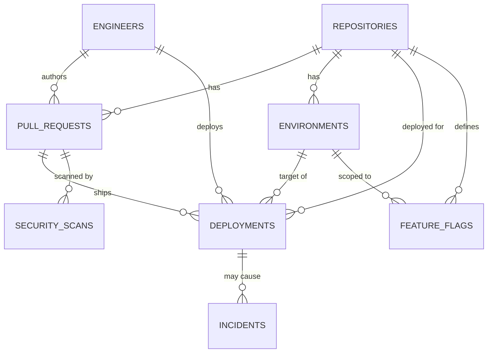

# Coderift Technologies — MCP Server Lab

## The company and the problem

Coderift Technologies is a software company. Internally, engineers deploy
code to production, manage feature flags, and handle security
vulnerability patches through an internal CLI/dashboard with full,
unscoped database access. There is no LLM-safe layer in front of any of
this.

The real risk: an engineer — or an LLM agent acting on an engineer's
behalf with the same unscoped access — could push straight to production,
skip a required security review, or roll back a deployment other
engineers depend on, with no audit trail and no human-in-the-loop check
on the riskiest actions. The seeded database already contains one
consequence of exactly this kind of gap: `billing-worker`'s production
deployment #1 failed after shipping an unreviewed caching change, and
produced an active, unresolved **critical** incident (`incidents` #1).

The fix built here: a real database with an ERD (`db/`), and an MCP
server (`mcp_server/`) sitting in front of it that a model talks to
instead of the database directly — enforcing role-based tool visibility,
mandatory human sign-off on the riskiest action, and scoped, validated
writes.

## Database / ERD

See `db/schema.sql` for the full DDL and `db/ERD.mmd` for the Mermaid
source. Eight tables: `engineers`, `repositories`, `pull_requests`,
`environments`, `deployments`, `security_scans`, `feature_flags`,
`incidents`. `db/seed.sql` includes the required edge cases: a PR with a
**Failed** security scan, a PR with a **Pending** scan, a **Failed**
deployment that produced an **open, critical** incident, an engineer at
every role level, and one **inactive** engineer (revoked access).



(Full attribute lists are in `db/ERD.mmd`; this block is a summary for
quick orientation.)

## Setup

```bash
pip install -r requirements.txt      # only needed for the HTTP transport
python db/init_db.py                 # builds db/coderift.db from schema+seed
python -m agent.client --all         # runs all 10 demo scenarios, stdio transport
```

`python -m mcp_server.server_http --port 8000` runs the Streamable HTTP
transport separately (see `mcp_server/server_http.py` and
`db/README.md` / `mcp_server/README.md` for details).

## The 9 protocol concerns, tied to a specific tool/trigger

1. **Capability negotiation.** `server.py: handle_initialize()` stores
   whatever capabilities the client declares; `SERVER_CAPABILITIES`
   promises `tools.listChanged: true`. `_tool_visible()` hides
   `deploy_to_production` and `draft_incident_summary` entirely from a
   client that never declared `elicitation`/`sampling` — demoed in both
   directions by `agent/scenarios.py`'s scenario 1 (full client) and
   scenario 2 (read-only client, using `check_deployment_status` as the
   mandated fallback, and getting a clean `ERR_CAPABILITY_UNSUPPORTED` if
   it calls `deploy_to_production` anyway).

2. **Notifications.** An engineer's role isn't fixed for the life of a
   connection — `authenticate` can be called again mid-session with a
   different access code (no reconnect), and each successful call fires
   `notifications/tools/list_changed`. Scenario 4 authenticates as junior,
   then promotes to senior on the same connection, and shows the tool set
   changing live both times.

3. **Elicitation.** `deploy_to_production` (`tools_impl/deploy_tools.py`)
   pauses via `elicitation/create` when either the target is production
   with a scan that isn't `Passed`, or the PR hasn't been through review
   (`status != Approved`) — the exact rule from
   `resources/production_deployment_policy.md` §3. Scenario 5 shows the
   clean/no-elicitation path; scenarios 6 and 7 show both outcomes of the
   pause (accepted, then declined).

4. **Sampling.** `draft_incident_summary`
   (`tools_impl/incident_tools.py`) assembles an incident's linked
   deployment and PR context, then asks the CLIENT's model via
   `sampling/createMessage` to draft a plain-language summary — the
   server never runs its own model. Demoed in scenario 9.

5. **Resources.** The Production Deployment Policy is exposed via
   `resources/list`/`resources/read`
   (`resources/production_deployment_policy.md`, wired in
   `mcp_server/resources.py`) — read once, reasoned over, not re-fetched
   as a function call on every deploy decision.

6. **Prompts.** Two parameterized templates via `prompts/list`/
   `prompts/get` (`mcp_server/prompts.py`): `draft_rollback_plan(deployment_id)`
   and `draft_incident_postmortem(incident_id)`, both filled from live DB
   lookups so two different ids produce two different, factually-grounded
   prompts.

7. **Transport (both).** `mcp_server/server.py` (stdio) was built and
   tested first; `mcp_server/server_http.py` (Streamable HTTP) was added
   afterward, reusing the same `dispatch()` function, because multiple
   Coderift engineers need concurrent remote access to one server process
   — a stdio server is inherently single-client, subprocessed by exactly
   one caller. See the git log for these as separate, real commits.

8. **Progress tracking.** `run_pre_deploy_checks`
   (`tools_impl/checks_tools.py`) runs unit tests, then integration
   tests, then a fresh security scan, sequentially, reporting real
   intermediate progress via `ctx.report_progress()` at each stage rather
   than one blocking response. Demoed in scenario 8.

9. **Defensive tool design.** `deploy_to_production`'s schema
   (`mcp_server/schemas.py`) is fully typed with `required` and
   `additionalProperties: false`. Its handler
   (`tools_impl/deploy_tools.py`) independently verifies the named
   environment actually belongs to the named repository, that the PR
   belongs to that repository, and that no deployment is already
   Pending/InProgress for that repo+environment — none of which a JSON
   Schema can express. Authorization is re-checked in the handler against
   a fresh database fetch of the engineer's role, not inferred from the
   schema or from what `tools/list` happened to show. Scenario 3 exercises
   the negative cases (missing field, disallowed extra field,
   unauthenticated write, unauthorized junior write, inactive access
   code); scenario 10 exercises a second flavor of the same discipline on
   `merge_pull_request`/`rollback_deployment`.

## Tools: read-only vs. write, and capability requirements

| Tool | Read/Write | Role required | Capability required | If capability missing |
|---|---|---|---|---|
| `authenticate` | — | none | — | always available |
| `check_deployment_status` | read | none | — | always available (the mandated fallback) |
| `get_pull_request` | read | none | — | always available |
| `list_active_incidents` | read | any authenticated | — | always available once authenticated |
| `list_feature_flags` | read | senior, lead | — | hidden below senior |
| `run_pre_deploy_checks` | write (scan row) | any authenticated | — | always available once authenticated |
| `draft_incident_summary` | read | any authenticated | sampling | **hidden from `tools/list`**; direct call raises `ERR_CAPABILITY_UNSUPPORTED` |
| `deploy_to_production` | write | senior, lead | elicitation | **hidden from `tools/list`**; direct call raises `ERR_CAPABILITY_UNSUPPORTED` |
| `merge_pull_request` | write | senior, lead | — | hidden below senior |
| `rollback_deployment` | write | senior, lead | — | hidden below senior |

Why `deploy_to_production` specifically needs `elicitation`: it's the one
tool that can silently ship an unreviewed or security-failing change to
production if nothing stops to ask a human. Every other write tool
(`merge_pull_request`, `rollback_deployment`) only requires a role — their
own defensive validation (PR must be Approved + Passed to merge; a
deployment must be Succeeded/InProgress to roll back) is enough to make
them safe without a human pause.

## Memory & RAG (Session 3 extension)

Two real problems emerge once engineers actually use this agent across
shifts, beyond what the MCP server's tools alone can fix:

**Problem 1 — Memory.** Engineers lose all session context when a
conversation ends. If Engineer A's session establishes that
`billing-worker` has had 3 consecutive failed deployments and an active
critical incident, Engineer B starting a fresh session has no memory of
this — the agent treats everything as brand new. `memory/` fixes this: a
rolling short-term buffer hands evicted messages to a promote-or-drop
router (`memory/router.py`, with zero structural access to semantic
memory), promoted messages become episodes, and a periodic — never
write-time — consolidation pass turns episodes into versioned, expirable
semantic facts (`memory/consolidation.py`, `memory/semantic_store.py`).
Semantic facts persist to disk (`memory/data/semantic_facts.json`) so a
**new `MemorySystem()` instance in a completely separate process** — a
different engineer's session — loads them on construction.
`demo/cross_session_memory_demo.py` proves this end to end: it runs two
genuinely separate sessions and confirms Engineer B's brand-new session
correctly refuses to treat `billing-worker` as safe to deploy to, without
ever having lived through Engineer A's conversation.

**Problem 2 — Knowledge.** Engineers ask questions the database was never
built to answer — "what's the required approval chain for a hotfix
deployment during an active incident?" — that only live in the company's
internal policy documents. `rag/` fixes this: three expanded policy
documents (`resources/production_deployment_policy.md`,
`security_review_policy.md`, `incident_response_runbook.md`, 40+
statements each) are chunked, embedded, and indexed in Chroma with
metadata filtering applied **during** HNSW search, not after. Three
retrieval architectures are implemented and evaluated against the same
12-question set (see `retrieval_eval/README.md` for the full comparison):
naive (baseline), hybrid (vector + BM25 via Reciprocal Rank Fusion — wins
on exact-identifier questions like "what does Section 4.2 say?"), and
agentic (a retrieve-observe-decide loop that combines multiple policies —
wins on multi-part questions naive/hybrid can only partially answer). A
bonus NetworkX-based Graph RAG (`rag/graph_rag.py`) is also implemented and
evaluated honestly against the same set — it does not beat agentic RAG on
this evaluation, and `rag/GRAPH_RAG_README.md` explains why rather than
hiding the result.

Every RAG answer and every memory recall passes through Self-RAG
verification (`rag/self_rag.py`) before being trusted — `check_relevance()`
and `check_support()`, each with a live-model path and a deterministic
offline fallback — so a recalled fact or a generated answer is never
presented with more confidence than the evidence behind it supports.

Context window management is a related but separate concern: a real
Coderift session involves dozens of tool calls, and an early critical
detail can get buried under tool JSON noise before the final question is
asked. `context_eval/` benchmarks four pruning strategies against 11
transcripts (40-turn base + 10 variations spanning different lengths and
critical-detail positions) and finds `observation_masking` wins — 100%
accuracy, fastest of the two 100%-accuracy strategies — because it targets
Coderift's actual bloat source (tool output, not dialogue). Full
justification and real numbers in `context_eval/README.md`.

```bash
# Build the vector store (once, or after editing a policy doc)
python3 rag/vector_store/vector_db.py

# Run the memory + RAG test suite
python3 -m pytest memory/tests/ -q

# Run the flagship cross-session memory demo
python3 demo/cross_session_memory_demo.py

# Run the context-window-management benchmark
cd context_eval && python3 benchmark.py

# Run the retrieval architecture evaluation
cd retrieval_eval && python3 run_eval.py

# Run the full agent demo including RAG + memory scenarios (12 total)
python3 -m agent.client --all
```

## Decomposition & Planning (Week 4 extension)

**The problem.** Two real requests neither the memory/RAG agent nor a
single MCP tool call can safely resolve on their own:

1. *"Prepare repository X for a production release."* Which candidate PRs
   are actually ready depends on scan status, an open-incident check, and
   sometimes a genuinely ambiguous case (a human-Approved PR whose
   security scan is still `Pending`, not `Failed` and not `Passed` — no
   single correct answer, only defensible strategies).
2. *"An incident is open on deployment X — what do we actually do?"*
   Proposing a concrete remediation action (rollback vs. redeploy) is
   real database state, not prose — a wrong guess is expensive to unwind,
   and there's real external ground truth (the deployment's actual
   status, whether an incident is genuinely open) to check the proposal
   against before it ships.

**The agent.** `planning_toolkit/` — the Release Readiness & Incident
Remediation Planning Agent, `planning_lab/agent.py` as its single routing
entry point — sits next to `memory/`/`rag/`, reuses the same
`mcp_server/`/`db/` everything else here uses, and never touches the
memory/RAG agent's code path. It implements, against real data, both
required decomposition methods (decomposition-first, dynamic/interleaved
— acyclicity enforced, a real divergence case), all three planning
algorithms routed by sub-task shape (Plan-and-Solve, Tree of Thoughts,
LATS), both self-correction scopes (Self-Refine, Reflexion), and a real
grounded `Environment` (plus a deliberately fake one kept only for the
required grounded-vs-ungrounded contrast).

See `planning_toolkit/README.md` for the full writeup, `planning_eval/`
for the complete cost & quality comparison table across every method
against a fixed real-request test suite, and
`planning_eval/DEMO_TRANSCRIPT.md` for a walkthrough of every required
demo element with real captured output.

```bash
python3 db/init_db.py
python3 -m planning_toolkit.compare_divergence
python3 -m planning_eval.run_eval
python3 -m pytest planning_toolkit/tests/ -v
```

## Feature Flag Rollout & Rollback Governance (Final Project — Person C)

Three real problems this graph solves, matching the same "real wait / real
branch / real failure" shape as Person A's Incident Response graph:

1. **Real wait.** A rollout percentage change doesn't show its true blast
   radius instantly — error-rate metrics need an observation window at
   the new traffic level. `awaiting_metrics` uses the same `WAIT_KEY`
   pattern as `awaiting_verification`: the graph genuinely pauses and
   waits for an external `metrics_result` event, it does not poll in a
   loop.
2. **Real branch.** Any step that reaches or crosses a **named
   blast-radius threshold of 50%** (`state_graph/rollout_lats.py:
   BLAST_RADIUS_THRESHOLD_PCT`) requires a human's sign-off before that
   percentage is actually set — `full_production_rollout` raises
   `Interrupt` with the flag name, repo, current %, target %, and the
   threshold itself in the payload, the same shape `hitl_lead_signoff`
   uses. Crucially, approval does **not** skip straight to 100%: it
   advances exactly one step through the normal `increase_pct -> canary`
   path, so the threshold-crossing percentage is actually canaried and
   metrics-checked like every other step.
3. **Real failure.** A flag-toggle tool call (`set_flag_percentage`) can
   fail for a real infrastructure reason (timeout, malformed response).
   `canary`/`auto_rollback` never catch this themselves —
   `FlagToggleAdapter` raises `NodeFailure` with `error_code =
   "FLAG_TOGGLE_TOOL_ERROR"`, which the shared `StateGraph.resume()` loop
   turns into a ticket, exactly like `deploy_fix`. `tests/
   test_flag_rollout.py::test_flag_toggle_tool_failure_opens_ticket_distinct_from_hitl`
   asserts `hitl_store.list_pending()` stays empty for that run.

### LATS: real numbers, not a single example

`state_graph/rollout_lats.py` searches three canonical rollout-percentage
orderings — `aggressive` `[5,25,50,100]`, `standard` `[10,30,60,100]`,
`conservative` `[1,5,15,40,100]` — scored by `score_sequence()`, a
deterministic function with two real, independently-computed terms:

- `jump_penalty`: sum of `(step_size/100)^2 x (1 + 20 x baseline_error_rate)`
  over consecutive steps — squaring means one big jump costs more than
  the same distance spread over several smaller jumps, and the repo's
  real DB-derived `baseline_error_rate` (from
  `mcp_server/db.py:get_historical_baseline_error_rate`, itself computed
  from actual high/critical incident counts against that repository —
  never a guess) amplifies every jump for a repo with a rockier incident
  history.
- `threshold_overshoot_penalty`: +0.15 for any single step that crosses
  the 50% blast-radius line in one jump of more than 30 percentage
  points (e.g. `conservative`'s final `40 -> 100` step) — independent of
  the raw jump-size penalty above.

Real numbers across three repositories in the seeded database:

| Repository | baseline_error_rate | aggressive | standard | conservative | Selected |
|---|---|---|---|---|---|
| `payments-service` | 0.01 | 0.426 | **0.36** | 0.671 | standard |
| `billing-worker` | 0.025 (1 critical incident on record) | 0.5325 | **0.45** | 0.8013 | standard |
| `checkout-web` | 0.01 | 0.426 | **0.36** | 0.671 | standard |

`standard` wins in all three seeded cases here, but the margin narrows as
`baseline_error_rate` rises — a repo with a worse incident history
doesn't flip the ranking on this particular candidate set, but it does
compress the gap, which is the real, checkable effect of the DB-grounded
penalty term. This is a one-level tree (root + one child per named
candidate), not an open-ended search — rollout-percentage orderings have
a small real catalog, unlike Person A's Task 2 LATS over open-ended
remediation actions.

### Constrained ReAct: the flag-toggle whitelist

`state_graph/flag_toggle_adapter.py`'s `ALLOWED_TOOLS = {"set_flag_percentage",
"get_error_rate_metrics"}` is the only surface `canary`
and `auto_rollback` can reach — enforced structurally in
`FlagToggleAdapter._call()`, which raises `NodeFailure` with
`error_code="FLAG_TOGGLE_TOOL_NOT_WHITELISTED"` for anything outside the
set. This matters because an unconstrained ReAct loop here could toggle
production traffic percentages in ways the graph never modeled.

### `mcp_server/` — no changes to gating

This branch adds two new tools (`set_flag_percentage`,
`get_error_rate_metrics`) and their `HANDLERS` entries only. The
per-agent tool gating in `server.py` (`_tool_visible`, `handle_tools_call`,
`TOOL_REGISTRY`, keyed off `session.agent_id`) — already built and
tested by Person A in `tests/test_tool_registry_enforcement.py` — is
untouched by this branch.

## Repository layout

```
db/               schema.sql, seed.sql, ERD.mmd, init_db.py, README.md
mcp_server/       server code — see mcp_server/README.md for the concern-by-concern index
resources/        Policy documents (RAG corpus) — production deployment, security review, incident response
prompts/          draft_rollback_plan / draft_incident_postmortem (prompt templates)
agent/            demo client (agent/README.md) + planning_client.py (planning agent CLI)
memory/           short-term buffer, router, episodic/semantic stores, consolidation, scheduler — memory/api.py is the only import surface
rag/              naive/hybrid/agentic/graph RAG, Self-RAG, vector store — see rag/README.md
context_eval/     context-window pruning strategy benchmark — see context_eval/README.md
retrieval_eval/   RAG architecture comparison — see retrieval_eval/README.md
demo/             DEMO_TRANSCRIPT.md (MCP lab, all 9 concerns) + cross_session_memory_demo.py (Session 3 flagship demo)
planning_toolkit/ Release Readiness & Incident Remediation Planning Agent — decomposition, PS/ToT/LATS, Self-Refine/Reflexion — see planning_toolkit/README.md
planning_eval/    Full cost/quality comparison table + fixed test suite + demo transcript for the planning agent
state_graph/      shared engine + incident_response.py + security_remediation.py + flag_rollout.py, flag_toggle_adapter.py, rollout_lats.py
user_platform/    the User Platform (project brief 2.3) — FastAPI backend + static chat UI, switches between all five live agents
```

