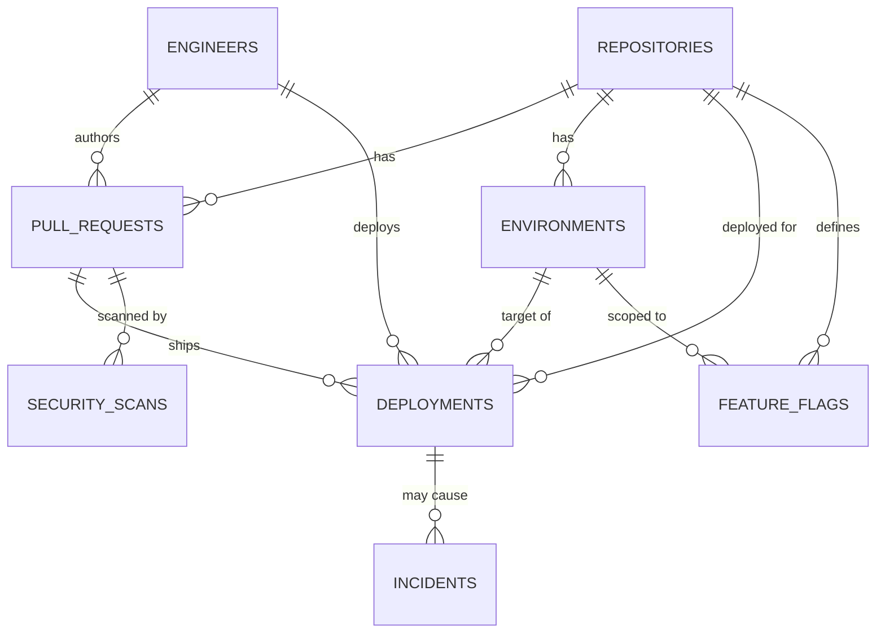

# Coderift Technologies — MCP Server Lab

## The company and the problem

Coderift Technologies is a software company. Internally, engineers deploy
code to production, manage feature flags, and handle security
vulnerability patches through an internal CLI/dashboard with full,
unscoped database access. There is no LLM-safe layer in front of any of
this.

The real risk: an engineer — or an LLM agent acting on an engineer's
behalf with the same unscoped access — could push straight to production,
skip a required security review, or roll back a deployment other
engineers depend on, with no audit trail and no human-in-the-loop check
on the riskiest actions. The seeded database already contains one
consequence of exactly this kind of gap: `billing-worker`'s production
deployment #1 failed after shipping an unreviewed caching change, and
produced an active, unresolved **critical** incident (`incidents` #1).

The fix built here: a real database with an ERD (`db/`), and an MCP
server (`mcp_server/`) sitting in front of it that a model talks to
instead of the database directly — enforcing role-based tool visibility,
mandatory human sign-off on the riskiest action, and scoped, validated
writes.

## Database / ERD

See `db/schema.sql` for the full DDL and `db/ERD.mmd` for the Mermaid
source. Eight tables: `engineers`, `repositories`, `pull_requests`,
`environments`, `deployments`, `security_scans`, `feature_flags`,
`incidents`. `db/seed.sql` includes the required edge cases: a PR with a
**Failed** security scan, a PR with a **Pending** scan, a **Failed**
deployment that produced an **open, critical** incident, an engineer at
every role level, and one **inactive** engineer (revoked access).



(Full attribute lists are in `db/ERD.mmd`; this block is a summary for
quick orientation.)

## Setup

```bash
pip install -r requirements.txt      # only needed for the HTTP transport
python db/init_db.py                 # builds db/coderift.db from schema+seed
python -m agent.client --all         # runs all 10 demo scenarios, stdio transport
```

`python -m mcp_server.server_http --port 8000` runs the Streamable HTTP
transport separately (see `mcp_server/server_http.py` and
`db/README.md` / `mcp_server/README.md` for details).

## The 9 protocol concerns, tied to a specific tool/trigger

1. **Capability negotiation.** `server.py: handle_initialize()` stores
   whatever capabilities the client declares; `SERVER_CAPABILITIES`
   promises `tools.listChanged: true`. `_tool_visible()` hides
   `deploy_to_production` and `draft_incident_summary` entirely from a
   client that never declared `elicitation`/`sampling` — demoed in both
   directions by `agent/scenarios.py`'s scenario 1 (full client) and
   scenario 2 (read-only client, using `check_deployment_status` as the
   mandated fallback, and getting a clean `ERR_CAPABILITY_UNSUPPORTED` if
   it calls `deploy_to_production` anyway).

2. **Notifications.** An engineer's role isn't fixed for the life of a
   connection — `authenticate` can be called again mid-session with a
   different access code (no reconnect), and each successful call fires
   `notifications/tools/list_changed`. Scenario 4 authenticates as junior,
   then promotes to senior on the same connection, and shows the tool set
   changing live both times.

3. **Elicitation.** `deploy_to_production` (`tools_impl/deploy_tools.py`)
   pauses via `elicitation/create` when either the target is production
   with a scan that isn't `Passed`, or the PR hasn't been through review
   (`status != Approved`) — the exact rule from
   `resources/production_deployment_policy.md` §3. Scenario 5 shows the
   clean/no-elicitation path; scenarios 6 and 7 show both outcomes of the
   pause (accepted, then declined).

4. **Sampling.** `draft_incident_summary`
   (`tools_impl/incident_tools.py`) assembles an incident's linked
   deployment and PR context, then asks the CLIENT's model via
   `sampling/createMessage` to draft a plain-language summary — the
   server never runs its own model. Demoed in scenario 9.

5. **Resources.** The Production Deployment Policy is exposed via
   `resources/list`/`resources/read`
   (`resources/production_deployment_policy.md`, wired in
   `mcp_server/resources.py`) — read once, reasoned over, not re-fetched
   as a function call on every deploy decision.

6. **Prompts.** Two parameterized templates via `prompts/list`/
   `prompts/get` (`mcp_server/prompts.py`): `draft_rollback_plan(deployment_id)`
   and `draft_incident_postmortem(incident_id)`, both filled from live DB
   lookups so two different ids produce two different, factually-grounded
   prompts.

7. **Transport (both).** `mcp_server/server.py` (stdio) was built and
   tested first; `mcp_server/server_http.py` (Streamable HTTP) was added
   afterward, reusing the same `dispatch()` function, because multiple
   Coderift engineers need concurrent remote access to one server process
   — a stdio server is inherently single-client, subprocessed by exactly
   one caller. See the git log for these as separate, real commits.

8. **Progress tracking.** `run_pre_deploy_checks`
   (`tools_impl/checks_tools.py`) runs unit tests, then integration
   tests, then a fresh security scan, sequentially, reporting real
   intermediate progress via `ctx.report_progress()` at each stage rather
   than one blocking response. Demoed in scenario 8.

9. **Defensive tool design.** `deploy_to_production`'s schema
   (`mcp_server/schemas.py`) is fully typed with `required` and
   `additionalProperties: false`. Its handler
   (`tools_impl/deploy_tools.py`) independently verifies the named
   environment actually belongs to the named repository, that the PR
   belongs to that repository, and that no deployment is already
   Pending/InProgress for that repo+environment — none of which a JSON
   Schema can express. Authorization is re-checked in the handler against
   a fresh database fetch of the engineer's role, not inferred from the
   schema or from what `tools/list` happened to show. Scenario 3 exercises
   the negative cases (missing field, disallowed extra field,
   unauthenticated write, unauthorized junior write, inactive access
   code); scenario 10 exercises a second flavor of the same discipline on
   `merge_pull_request`/`rollback_deployment`.

## Tools: read-only vs. write, and capability requirements

| Tool | Read/Write | Role required | Capability required | If capability missing |
|---|---|---|---|---|
| `authenticate` | — | none | — | always available |
| `check_deployment_status` | read | none | — | always available (the mandated fallback) |
| `get_pull_request` | read | none | — | always available |
| `list_active_incidents` | read | any authenticated | — | always available once authenticated |
| `list_feature_flags` | read | senior, lead | — | hidden below senior |
| `run_pre_deploy_checks` | write (scan row) | any authenticated | — | always available once authenticated |
| `draft_incident_summary` | read | any authenticated | sampling | **hidden from `tools/list`**; direct call raises `ERR_CAPABILITY_UNSUPPORTED` |
| `deploy_to_production` | write | senior, lead | elicitation | **hidden from `tools/list`**; direct call raises `ERR_CAPABILITY_UNSUPPORTED` |
| `merge_pull_request` | write | senior, lead | — | hidden below senior |
| `rollback_deployment` | write | senior, lead | — | hidden below senior |

Why `deploy_to_production` specifically needs `elicitation`: it's the one
tool that can silently ship an unreviewed or security-failing change to
production if nothing stops to ask a human. Every other write tool
(`merge_pull_request`, `rollback_deployment`) only requires a role — their
own defensive validation (PR must be Approved + Passed to merge; a
deployment must be Succeeded/InProgress to roll back) is enough to make
them safe without a human pause.

## Repository layout

```
db/               schema.sql, seed.sql, ERD.mmd, init_db.py, README.md
mcp_server/       server code — see mcp_server/README.md for the concern-by-concern index
resources/        Production Deployment Policy (resource content)
prompts/          draft_rollback_plan / draft_incident_postmortem (prompt templates)
agent/            demo client — see agent/README.md
demo/             DEMO_TRANSCRIPT.md — a full --all run, all 9 concerns firing
```
